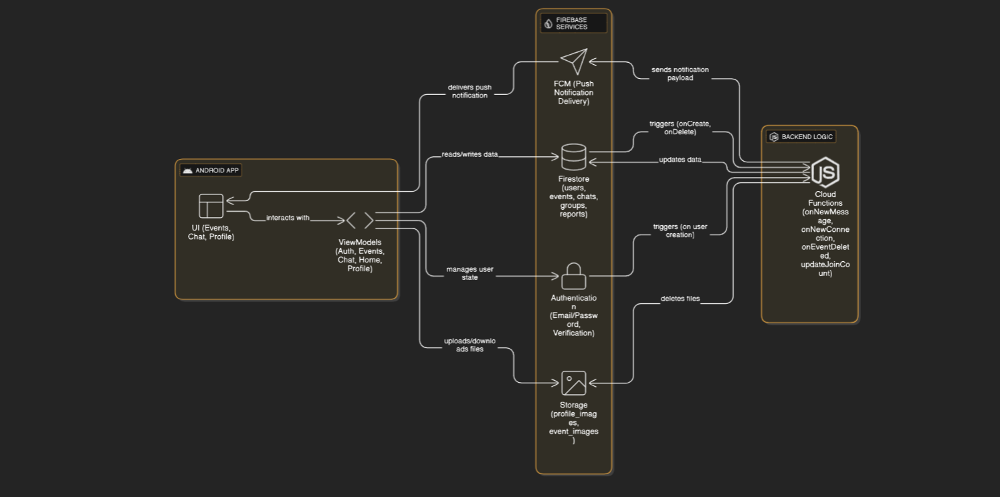

<p align="center">
  
</p>

<h1 align="center">Vibe</h1>
<p align="center">
  <strong>Connect. Discover. Experience.</strong>
</p>

<p align="center">
  
  
  
  
</p>

<p align="center">
  
  
  
</p>

---

## 📥 Download

Get the latest version of Vibe directly:

<p align="center">
  <a href="https://github.com/infiniteflux/vibe/raw/master/app/apk/vibe.apk">
    
  </a>
</p>

---

## 📖 Overview

**Vibe** is a modern, real-time social event discovery and connection platform built with cutting-edge Android technologies. The app enables users to:

- 🎉 **Discover** local events happening around them
- 🤝 **Connect** with like-minded attendees through a unique post-event rating system  
- 💬 **Communicate** through real-time group and private messaging
- 🔔 **Stay Updated** with push notifications for new events, connections, and messages

---

## 🏗️ Architecture

Vibe follows the **MVVM (Model-View-ViewModel)** architectural pattern with a clean separation of concerns, leveraging Firebase as a Backend-as-a-Service (BaaS) platform.

### Architecture Diagram

<p align="center">
  
</p>

### Component Flow

```
┌─────────────────────────────────────────────────────────────────────────────┐
│                              ANDROID APPLICATION                            │
├─────────────────────────────────────────────────────────────────────────────┤
│                                                                             │
│  ┌─────────────────────────────────────────────────────────────────────┐   │
│  │                         UI LAYER (Jetpack Compose)                   │   │
│  │  ┌─────────┐ ┌─────────┐ ┌─────────┐ ┌─────────┐ ┌─────────────────┐│   │
│  │  │  Login  │ │  Home   │ │  Chat   │ │ Events  │ │ Profile/Settings││   │
│  │  │ Screens │ │ Screen  │ │ Screens │ │ Screens │ │     Screens     ││   │
│  │  └────┬────┘ └────┬────┘ └────┬────┘ └────┬────┘ └────────┬────────┘│   │
│  └───────┼──────────▼──────────┼──────────┼──────────────────┼─────────┘   │
│          │                      │          │                  │             │
│  ┌───────▼──────────────────────▼──────────▼──────────────────▼─────────┐   │
│  │                         VIEWMODEL LAYER                              │   │
│  │  ┌──────────┐ ┌──────────┐ ┌──────────┐ ┌────────────┐ ┌──────────┐ │   │
│  │  │  Auth    │ │  Home    │ │  Chat    │ │  Events    │ │ Profile  │ │   │
│  │  │ViewModel │ │ViewModel │ │ViewModel │ │ ViewModel  │ │ViewModel │ │   │
│  │  └──────────┘ └──────────┘ └──────────┘ └────────────┘ └──────────┘ │   │
│  │  ┌────────────┐ ┌──────────────┐ ┌─────────────┐ ┌────────────────┐ │   │
│  │  │ Connection │ │ Notification │ │   Report    │ │  WallOfShame   │ │   │
│  │  │  ViewModel │ │  ViewModel   │ │  ViewModel  │ │   ViewModel    │ │   │
│  │  └────────────┘ └──────────────┘ └─────────────┘ └────────────────┘ │   │
│  └───────────────────────────────┬──────────────────────────────────────┘   │
│                                  │                                          │
│  ┌───────────────────────────────▼──────────────────────────────────────┐   │
│  │                           DATA LAYER                                 │   │
│  │  ┌───────────┐ ┌───────────┐ ┌───────────┐ ┌───────────┐            │   │
│  │  │ ChatData  │ │ EventData │ │Connection │ │ Report &  │            │   │
│  │  │  Models   │ │  Models   │ │   Data    │ │Shame Data │            │   │
│  │  └───────────┘ └───────────┘ └───────────┘ └───────────┘            │   │
│  └───────────────────────────────┬──────────────────────────────────────┘   │
└──────────────────────────────────┼──────────────────────────────────────────┘
                                   │
                                   ▼
┌─────────────────────────────────────────────────────────────────────────────┐
│                            FIREBASE SERVICES                                │
├─────────────────────────────────────────────────────────────────────────────┤
│                                                                             │
│  ┌─────────────┐  ┌─────────────┐  ┌─────────────┐  ┌─────────────────────┐│
│  │   Firebase  │  │  Firestore  │  │   Cloud     │  │  Cloud Functions    ││
│  │    Auth     │  │  Database   │  │   Storage   │  │  (Node.js Backend)  ││
│  │             │  │             │  │             │  │                     ││
│  │ • Email/    │  │ • Users     │  │ • Profile   │  │ • onNewMessage      ││
│  │   Password  │  │ • Events    │  │   Images    │  │ • onNewConnection   ││
│  │ • Email     │  │ • Chats     │  │ • Event     │  │ • onEventCreate     ││
│  │   Verify    │  │ • Groups    │  │   Images    │  │ • onEventDelete     ││
│  │             │  │ • Reports   │  │             │  │ • updateJoinCount   ││
│  └──────┬──────┘  └──────┬──────┘  └──────┬──────┘  └──────────┬──────────┘│
│         │                │                │                     │          │
│         └────────────────┴────────────────┴─────────────────────┘          │
│                                   │                                         │
│                                   ▼                                         │
│                     ┌─────────────────────────────┐                        │
│                     │  Firebase Cloud Messaging   │                        │
│                     │          (FCM)              │                        │
│                     │                             │                        │
│                     │  • New Message Alerts       │                        │
│                     │  • Connection Notifications │                        │
│                     │  • Event Updates            │                        │
│                     └─────────────────────────────┘                        │
└─────────────────────────────────────────────────────────────────────────────┘
```

### Data Flow

```
User Action → Screen (Composable) → ViewModel → Firebase Service → Real-time Update → UI
```

---

## 📁 Project Structure

```
app/
├── src/main/
│   ├── java/com/infiniteflux/login_using_firebase/
│   │   ├── MainActivity.kt           # Entry point & navigation host
│   │   ├── MyApplication.kt          # Application class with Firebase init
│   │   │
│   │   ├── cloud/                     # Firebase Cloud Services
│   │   │   └── MyFirebaseMessagingService.kt
│   │   │
│   │   ├── data/                      # Data Models
│   │   │   ├── ChatData.kt
│   │   │   ├── ConnectionData.kt
│   │   │   ├── EventsData.kt
│   │   │   ├── HomeData.kt
│   │   │   ├── NotificationData.kt
│   │   │   ├── ReportData.kt
│   │   │   └── WallOfShameData.kt
│   │   │
│   │   ├── navcontroller/             # Navigation Setup
│   │   │   └── NavController.kt
│   │   │
│   │   ├── screens/                   # UI Screens (Composables)
│   │   │   ├── login/                 # Auth Screens
│   │   │   ├── discover/              # Discovery Screens
│   │   │   ├── event/                 # Event Management
│   │   │   ├── chat/                  # Messaging Screens
│   │   │   ├── profile/               # User Profile
│   │   │   └── Notification/          # Notification Center
│   │   │
│   │   ├── viewmodel/                 # ViewModels (Business Logic)
│   │   │   ├── AuthViewModel.kt
│   │   │   ├── ChatViewModel.kt
│   │   │   ├── ConnectionViewModel.kt
│   │   │   ├── EventsViewModel.kt
│   │   │   ├── HomeViewModel.kt
│   │   │   ├── NotificationViewModel.kt
│   │   │   ├── ProfileViewModel.kt
│   │   │   ├── ReportViewModel.kt
│   │   │   └── WallOfShameViewModel.kt
│   │   │
│   │   ├── sharedComponents/          # Reusable UI Components
│   │   └── ui/                        # Theme & Styling
│   │
│   └── res/                           # Android Resources
│
├── apk/
│   └── vibe.apk                       # Production APK
│
└── img/
    └── diagram.png                    # Architecture Diagram
```

---

## ✨ Features

### 🔐 Authentication System
| Feature | Description |
|---------|-------------|
| **Guest Mode** | Browse events without account creation |
| **Email/Password Auth** | Secure sign-up and login flow |
| **Email Verification** | Verify user email for account activation |
| **Protected Actions** | Seamless login prompts for authenticated features |

### 🎪 Event Management
| Feature | Description |
|---------|-------------|
| **Create Events** | Creators can publish events with images |
| **Join Events** | One-tap event registration |
| **Trending Section** | Auto-curated popular upcoming events |
| **Real-time Updates** | Live attendee count and event status |

### 🌟 Post-Event Connection System
| Feature | Description |
|---------|-------------|
| **Rate Attendees** | Rate other attendees after event ends |
| **"Spark" Matching** | Mutual high ratings create connections |
| **My Connections** | View all successful matches |

### 💬 Real-time Messaging
| Feature | Description |
|---------|-------------|
| **Group Chats** | Create and join group conversations |
| **Private 1-on-1** | Direct messaging with connections |
| **Live Updates** | Real-time message sync with unread indicators |
| **Last Message Preview** | Quick glance at recent messages |

### 👥 Role-Based Access
| Role | Capabilities |
|------|-------------|
| **User** | Browse, join events, chat, rate attendees |
| **Creator** | All user features + create events, manage groups |
| **Admin** | Full moderation capabilities |

### 🛡️ Community Moderation
- **Report System**: Flag inappropriate users
- **Wall of Shame**: Display banned users
- **Admin Controls**: Manage community standards

### 🔔 Push Notifications
- New message alerts
- Connection notifications
- Event reminders and updates
- In-app notification center

---

## 🛠️ Technology Stack

### Frontend
| Technology | Purpose |
|------------|---------|
| **Kotlin** | Primary programming language |
| **Jetpack Compose** | Modern declarative UI framework |
| **Compose Navigation** | Type-safe navigation management |
| **Material 3** | Design system implementation |
| **Coil** | Efficient image loading |
| **LiveData** | Reactive data observation |

### Backend (Firebase)
| Service | Purpose |
|---------|---------|
| **Firebase Auth** | User authentication & management |
| **Cloud Firestore** | Real-time NoSQL database |
| **Cloud Storage** | Image & media storage |
| **Cloud Functions** | Serverless backend logic |
| **Cloud Messaging (FCM)** | Push notification delivery |

### Cloud Functions (Backend Logic)
```javascript
// Automated triggers for:
onNewMessage()       // Send push notification on new messages
onNewConnection()    // Notify users of new connections
onEventCreate()      // Alert followers of new events
onEventDelete()      // Clean up event-related data
updateJoinCount()    // Maintain accurate attendee counts
```

---

## ⚙️ Setup & Configuration

### Prerequisites
- Android Studio Arctic Fox or later
- JDK 11+
- Firebase account
- Node.js (for Cloud Functions deployment)

### 1. Clone Repository
```bash
git clone https://github.com/infiniteflux/vibe.git
cd vibe
```

### 2. Firebase Setup
1. Create a new project in [Firebase Console](https://console.firebase.google.com/)
2. Add Android app with package name: `com.infiniteflux.login_using_firebase`
3. Download `google-services.json` → place in `app/` directory
4. Add SHA-1/SHA-256 fingerprints for your debug & release keys

### 3. Enable Firebase Services
```
✓ Authentication (Email/Password provider)
✓ Cloud Firestore
✓ Cloud Storage
✓ Cloud Messaging
```

### 4. Deploy Cloud Functions
```bash
cd functions
npm install
firebase login
firebase deploy --only functions
```

### 5. Create Firestore Indexes
Run the app and check Logcat for index creation links, then create required composite indexes through Firebase Console.

### 6. Build & Run
```bash
./gradlew assembleDebug
# or use Android Studio Run button
```

---

## 📋 Requirements

| Requirement | Specification |
|-------------|---------------|
| **Minimum SDK** | API 28 (Android 9.0) |
| **Target SDK** | API 35 (Android 15) |
| **Compile SDK** | 35 |
| **JVM Target** | Java 11 |

---

## 🤝 Contributing

1. Fork the repository
2. Create feature branch (`git checkout -b feature/AmazingFeature`)
3. Commit changes (`git commit -m 'Add AmazingFeature'`)
4. Push to branch (`git push origin feature/AmazingFeature`)
5. Open a Pull Request

---

## 📄 License

This project is proprietary software. All rights reserved.

---

<p align="center">
  Built with ❤️ using Kotlin & Jetpack Compose
</p>
<p align="center">
  <strong>Vibe</strong> — Where Events Meet Connections
</p>
